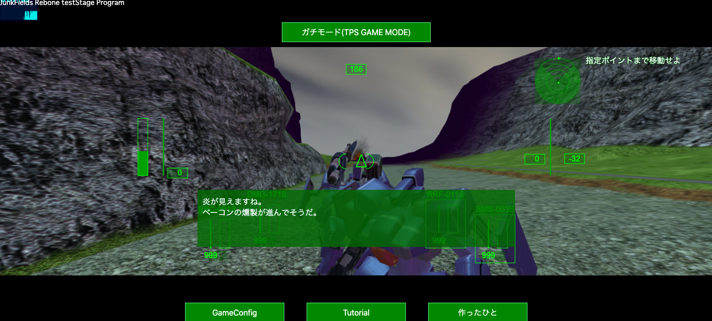

# Three_FPS

本開発環境

```
three_fps/main/index.html
```

## デバッグの方法
サーバー建てるときは以下のコマンドを叩く．

```
python -m http.server
```

## 参考文献

- https://ics.media/tutorial-createjs/game_shooting/
create.jsを使った2Dのシューティングゲームチュートリアル一式

- https://qiita.com/gen_abe/items/3846dd9a896782effecf
カメラ移動だけ

- https://docs.microsoft.com/ja-jp/windows/uwp/get-started/get-started-tutorial-game-js3d
恐竜から逃げるゲームのチュートリアル一式．これをベースに作っていくのがいいかも．

- https://github.com/blaze33/droneWorld
飛行機のシューティングゲーム完成版

- https://codepen.io/frhd/pen/bZJZWB
大勝利．fpsの機能一式コード

- https://github.com/saucecode/threejs-demos
学習用のチュートリアル．これで作成したソースコードはdemo内に保存．

- https://qiita.com/adrs2002/items/dd26fa318f7aa6aedc04
逆引きtips．完成度が神．

</img>

- https://discourse.threejs.org/t/collisions-two-objects/4125/3
衝突判定

- https://qiita.com/39_isao/items/e7b204042aea2ce8c2ba
タイトルページ用のパーティクル．

- https://ics.media/tutorial-three/class/
敵のクラス化

- https://qiita.com/o_tyazuke/items/5d407823cf637bc564b4
メッシュの複製．mergeするやつ

```
for(var i=0; i<10; i++){
  for(var j=0; j<10; j++){
    for(var k=0; k<10; k++){
      meshItem.position.x = k*6 + k*1;
      meshItem.position.y = j*6 + j*1;
      meshItem.position.z = i*6 + i*1;

      geometry.mergeMesh(meshItem);
    }
  }
}
```

- https://www.creativebloq.com/web-design/build-basic-combat-game-threejs-101517540
スコープの表示

- https://qiita.com/ut0n/items/4abc77ac670463f9b657
敵のランダム移動


1. cubeの表示とそのアニメーション
2. 床の生成とキー入力に応じた移動，左右の回転，ボタンクリックによるワイヤーフレームの切り替え
移動のベクトル制御とかはmicrosoftのチュートリアルを見て理論も押さえておく
```
camera.position.x -= Math.sin(camera.rotation.y) * player.speed;
		camera.position.z -= -Math.cos(camera.rotation.y) * player.speed;
```
3. 光源の生成
- https://qiita.com/everycamel/items/6b373930e79893adb340
    - meshbasicmaterialだと影が落ちない
    - 影の出し手と受けてを指定する必要あり

- ambientlight
基本的なライトであり，すべてのオブジェクトにライトの色をつける．特定の入射角がないため影を落とさないほか，すべてのオブジェクトに対して同じ色を投影するため，単独で使われることはない．明るい色を指定するとすぐに画面全体の彩度が異常に高くなる．


4. テクスチャ
サーバー建てないとテクスチャをロードできない

マテリアルのプロパティとして設定する
- map
基本的なテクスチャ
- bumpMap
グレースケール画像でピクセルの明度によって凹凸の高さを指定する．これを適用するとテクスチャに奥行きがでる．
- normalMap
法線マップ．光源にも反応する．

- 2の累乗の長さの正方形がうまく動作する

5. モデルとマテリアルのロード
MTLLoaderで得られたマテリアルをOBJLoaderに設定する必要があるため，MTLLoaderのコールバック内でOBJLoaderを使用する．

6. ローディング画面
これは不要

7. 複数のモデルのインスタンス生成
できない
```
REMEMBER: Loading in Javascript is asynchronous, so you need
to wrap the code in a function and pass it the index. If you
don't, then the index '_key' can change while the model is being
downloaded, and so the wrong model will be matched with the wrong index key.
```

8. 銃が見えるfps視点

9. 弾丸の生成